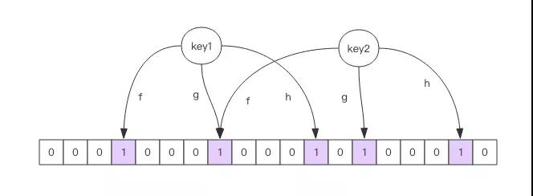
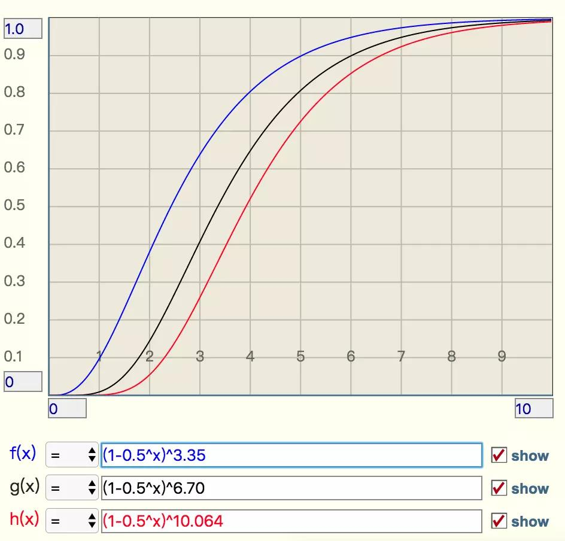

## 应用 5：布隆过滤器

上一节我们学会了使用 HyperLogLog 数据结构来进行估数，它非常有价值，可以解决很多精确度不高的统计需求。

但是如果我们想知道某一个值是不是已经在 HyperLogLog 结构里面了，它就无能为力了，它只提供了 pfadd 和 pfcount 方法，没有提供 pfcontains 这种方法。

讲个使用场景，比如我们在使用新闻客户端看新闻时，它会给我们不停地推荐新的内容，它每次推荐时要去重，去掉那些已经看过的内容。问题来了，新闻客户端推荐系统如何实现推送去重的？

你会想到服务器记录了用户看过的所有历史记录，当推荐系统推荐新闻时会从每个用户的历史记录里进行筛选，过滤掉那些已经存在的记录。问题是当用户量很大，每个用户看过的新闻又很多的情况下，这种方式，推荐系统的去重工作在性能上跟的上么？

实际上，如果历史记录存储在关系数据库里，去重就需要频繁地对数据库进行 exists 查询，当系统并发量很高时，数据库是很难扛住压力的。

你可能又想到了缓存，但是如此多的历史记录全部缓存起来，那得浪费多大存储空间啊？而且这个存储空间是随着时间线性增长，你撑得住一个月，你能撑得住几年么？但是不缓存的话，性能又跟不上，这该怎么办？

这时，布隆过滤器 (Bloom Filter) 闪亮登场了，它就是专门用来解决这种去重问题的。它在起到去重的同时，在空间上还能节省 90% 以上，只是稍微有那么点不精确，也就是有一定的误判概率。

## 布隆过滤器是什么？

布隆过滤器可以理解为一个不怎么精确的 set 结构，当你使用它的 contains 方法判断某个对象是否存在时，它可能会误判。但是布隆过滤器也不是特别不精确，只要参数设置的合理，它的精确度可以控制的相对足够精确，只会有小小的误判概率。

当布隆过滤器说某个值存在时，这个值可能不存在；当它说不存在时，那就肯定不存在。打个比方，当它说不认识你时，肯定就不认识；当它说见过你时，可能根本就没见过面，不过因为你的脸跟它认识的人中某脸比较相似 (某些熟脸的系数组合)，所以误判以前见过你。

套在上面的使用场景中，布隆过滤器能准确过滤掉那些已经看过的内容，那些没有看过的新内容，它也会过滤掉极小一部分 (误判)，但是绝大多数新内容它都能准确识别。这样就可以完全保证推荐给用户的内容都是无重复的。

## Redis 中的布隆过滤器

Redis 官方提供的布隆过滤器到了 Redis 4.0 提供了插件功能之后才正式登场。布隆过滤器作为一个插件加载到 Redis Server 中，给 Redis 提供了强大的布隆去重功能。

下面我们来体验一下 Redis 4.0 的布隆过滤器，为了省去繁琐安装过程，我们直接用 Docker 吧。

~~~bash
> docker pull redislabs/rebloom  # 拉取镜像
> docker run -p6379:6379 redislabs/rebloom  # 运行容器
> redis-cli  # 连接容器中的 redis 服务
~~~
如果上面三条指令执行没有问题，下面就可以体验布隆过滤器了。

## 布隆过滤器基本使用

布隆过滤器有二个基本指令，bf.add 添加元素，bf.exists 查询元素是否存在，它的用法和 set 集合的 sadd 和 sismember 差不多。注意 bf.add 只能一次添加一个元素，如果想要一次添加多个，就需要用到 bf.madd 指令。同样如果需要一次查询多个元素是否存在，就需要用到 bf.mexists 指令。

~~~
127.0.0.1:6379> bf.add codehole user1
(integer) 1
127.0.0.1:6379> bf.add codehole user2
(integer) 1
127.0.0.1:6379> bf.add codehole user3
(integer) 1
127.0.0.1:6379> bf.exists codehole user1
(integer) 1
127.0.0.1:6379> bf.exists codehole user2
(integer) 1
127.0.0.1:6379> bf.exists codehole user3
(integer) 1
127.0.0.1:6379> bf.exists codehole user4
(integer) 0
127.0.0.1:6379> bf.madd codehole user4 user5 user6
1) (integer) 1
2) (integer) 1
3) (integer) 1
127.0.0.1:6379> bf.mexists codehole user4 user5 user6 user7
1) (integer) 1
2) (integer) 1
3) (integer) 1
4) (integer) 0...
~~~

似乎很准确啊，一个都没误判。下面我们用 Python 脚本加入很多元素，看看加到第几个元素的时候，布隆过滤器会出现误判。

~~~python

# coding: utf-8

import redis

client = redis.StrictRedis()

client.delete("codehole")
for i in range(100000):
    client.execute_command("bf.add", "codehole", "user%d" % i)
    ret = client.execute_command("bf.exists", "codehole", "user%d" % i)
    if ret == 0:
        print i
        break...

~~~

Java 客户端 Jedis-2.x 没有提供指令扩展机制，所以你无法直接使用 Jedis 来访问 Redis Module 提供的 bf.xxx 指令。RedisLabs 提供了一个单独的包 JReBloom，但是它是基于 Jedis-3.0，Jedis-3.0 这个包目前还没有进入 release，没有进入 maven 的中央仓库，需要在 Github 上下载。在使用上很不方便，如果怕麻烦，还可以使用 lettuce，它是另一个 Redis 的客户端，相比 Jedis 而言，它很早就支持了指令扩展。...
~~~java
public class BloomTest {

  public static void main(String[] args) {
    Client client = new Client();

    client.delete("codehole");
    for (int i = 0; i < 100000; i++) {
      client.add("codehole", "user" + i);
      boolean ret = client.exists("codehole", "user" + i);
      if (!ret) {
        System.out.println(i);
        break;
      }
    }

    client.close();
  }

}...

~~~

执行上面的代码后，你会张大了嘴巴发现居然没有输出，塞进去了 100000 个元素，还是没有误判，这是怎么回事？如果你不死心的话，可以将数字再加一个 0 试试，你会发现依然没有误判。

原因就在于布隆过滤器对于已经见过的元素肯定不会误判，它只会误判那些没见过的元素。所以我们要稍微改一下上面的脚本，使用 bf.exists 去查找没见过的元素，看看它是不是以为自己见过了。...

~~~python

# coding: utf-8

import redis

client = redis.StrictRedis()

client.delete("codehole")
for i in range(100000):
    client.execute_command("bf.add", "codehole", "user%d" % i)
    # 注意 i+1，这个是当前布隆过滤器没见过的
    ret = client.execute_command("bf.exists", "codehole", "user%d" % (i+1))
    if ret == 1:
        print i
        break...

~~~
Java 版:

~~~java
public class BloomTest {

  public static void main(String[] args) {
    Client client = new Client();

    client.delete("codehole");
    for (int i = 0; i < 100000; i++) {
      client.add("codehole", "user" + i);
      boolean ret = client.exists("codehole", "user" + (i + 1));
      if (ret) {
        System.out.println(i);
        break;
      }
    }

    client.close();
  }

}...
~~~
运行后，我们看到了输出是 214，也就是到第 214 的时候，它出现了误判。

那如何来测量误判率呢？我们先随机出一堆字符串，然后切分为 2 组，将其中一组塞入布隆过滤器，然后再判断另外一组的字符串存在与否，取误判的个数和字符串总量一半的百分比作为误判率。...

~~~python
# coding: utf-8

import redis
import random

client = redis.StrictRedis()

CHARS = ''.join([chr(ord('a') + i) for i in range(26)])

def random_string(n):
    chars = []
    for i in range(n):
        idx = random.randint(0, len(CHARS) - 1)
        chars.append(CHARS[idx])
    return ''.join(chars)

users = list(set([random_string(64) for i in range(100000)]))
print 'total users', len(users)
users_train = users[:len(users)/2]
users_test = users[len(users)/2:]

client.delete("codehole")
falses = 0

for user in users_train:
    client.execute_command("bf.add", "codehole", user)
print 'all trained'
for user in users_test:
    ret = client.execute_command("bf.exists", "codehole", user)
    if ret == 1:
        falses += 1

print falses, len(users_test)...
~~~
Java 版:

~~~java
public class BloomTest {

  private String chars;
  {
    StringBuilder builder = new StringBuilder();
    for (int i = 0; i < 26; i++) {
      builder.append((char) ('a' + i));
    }
    chars = builder.toString();
  }

  private String randomString(int n) {
    StringBuilder builder = new StringBuilder();
    for (int i = 0; i < n; i++) {
      int idx = ThreadLocalRandom.current().nextInt(chars.length());
      builder.append(chars.charAt(idx));
    }
    return builder.toString();
  }

  private List<String> randomUsers(int n) {
    List<String> users = new ArrayList<>();
    for (int i = 0; i < 100000; i++) {
      users.add(randomString(64));
    }
    return users;
  }

public static void main(String[] args) {
    BloomTest bloomer = new BloomTest();
    List<String> users = bloomer.randomUsers(100000);
    List<String> usersTrain = users.subList(0, users.size() / 2);
    List<String> usersTest = users.subList(users.size() / 2, users.size());

    Client client = new Client();
    client.delete("codehole");
    for (String user : usersTrain) {
      client.add("codehole", user);
    }
    int falses = 0;
    for (String user : usersTest) {
      boolean ret = client.exists("codehole", user);
      if (ret) {
        falses++;
      }
    }
    System.out.printf("%d %d\n", falses, usersTest.size());
    client.close();
  }

}...
~~~

运行一下，等待大约一分钟，输出:

~~~
total users 100000
all trained
628 50000
~~~

可以看到误判率大约 1% 多点。你也许会问这个误判率还是有点高啊，有没有办法降低一点？答案是有的。

我们上面使用的布隆过滤器只是默认参数的布隆过滤器，它在我们第一次 add 的时候自动创建。Redis 其实还提供了自定义参数的布隆过滤器，需要我们在 add 之前使用bf.reserve指令显式创建。如果对应的 key 已经存在，bf.reserve会报错。bf.reserve有三个参数，分别是 key, error_rate和initial_size。错误率越低，需要的空间越大。initial_size参数表示预计放入的元素数量，当实际数量超出这个数值时，误判率会上升。

所以需要提前设置一个较大的数值避免超出导致误判率升高。如果不使用 bf.reserve，默认的error_rate是 0.01，默认的initial_size是 100。

接下来我们使用 bf.reserve 改造一下上面的脚本：...

~~~python
# coding: utf-8

import redis
import random

client = redis.StrictRedis()

CHARS = ''.join([chr(ord('a') + i) for i in range(26)])

def random_string(n):
    chars = []
    for i in range(n):
        idx = random.randint(0, len(CHARS) - 1)
        chars.append(CHARS[idx])
    return ''.join(chars)

users = list(set([random_string(64) for i in range(100000)]))
print 'total users', len(users)
users_train = users[:len(users)/2]
users_test = users[len(users)/2:]

falses = 0
client.delete("codehole")
# 增加了下面这一句
client.execute_command("bf.reserve", "codehole", 0.001, 50000)
for user in users_train:
    client.execute_command("bf.add", "codehole", user)
print 'all trained'
for user in users_test:
    ret = client.execute_command("bf.exists", "codehole", user)
    if ret == 1:
        falses += 1

print falses, len(users_test)...
~~~

Java 版本：
~~~java
public class BloomTest {

  private String chars;
  {
    StringBuilder builder = new StringBuilder();
    for (int i = 0; i < 26; i++) {
      builder.append((char) ('a' + i));
    }
    chars = builder.toString();
  }

  private String randomString(int n) {
    StringBuilder builder = new StringBuilder();
    for (int i = 0; i < n; i++) {
      int idx = ThreadLocalRandom.current().nextInt(chars.length());
      builder.append(chars.charAt(idx));
    }
    return builder.toString();
  }

  private List<String> randomUsers(int n) {
    List<String> users = new ArrayList<>();
    for (int i = 0; i < 100000; i++) {
      users.add(randomString(64));
    }
    return users;
  }

 public static void main(String[] args) {
    BloomTest bloomer = new BloomTest();
    List<String> users = bloomer.randomUsers(100000);
    List<String> usersTrain = users.subList(0, users.size() / 2);
    List<String> usersTest = users.subList(users.size() / 2, users.size());

    Client client = new Client();
    client.delete("codehole");
    // 对应 bf.reserve 指令
    client.createFilter("codehole", 50000, 0.001);
    for (String user : usersTrain) {
      client.add("codehole", user);
    }
    int falses = 0;
    for (String user : usersTest) {
      boolean ret = client.exists("codehole", user);
      if (ret) {
        falses++;
      }
    }
    System.out.printf("%d %d\n", falses, usersTest.size());
    client.close();
  }

}...

~~~
运行一下，等待约 1 分钟，输出如下：

~~~
total users 100000
all trained
6 50000
~~~

## 注意事项

布隆过滤器的`initial_size`估计的过大，会浪费存储空间，估计的过小，就会影响准确率，用户在使用之前一定要尽可能地精确估计好元素数量，还需要加上一定的冗余空间以避免实际元素可能会意外高出估计值很多。

布隆过滤器的`error_rate`越小，需要的存储空间就越大，对于不需要过于精确的场合，`error_rate`设置稍大一点也无伤大雅。比如在新闻去重上而言，误判率高一点只会让小部分文章不能让合适的人看到，文章的整体阅读量不会因为这点误判率就带来巨大的改变。...

## 布隆过滤器的原理

每个布隆过滤器对应到 Redis 的数据结构里面就是一个大型的位数组和几个不一样的无偏 hash 函数。所谓无偏就是能够把元素的 hash 值算得比较均匀。

向布隆过滤器中添加 key 时，会使用多个 hash 函数对 key 进行 hash 算得一个整数索引值然后对位数组长度进行取模运算得到一个位置，每个 hash 函数都会算得一个不同的位置。再把位数组的这几个位置都置为 1 就完成了 add 操作。

向布隆过滤器询问 key 是否存在时，跟 add 一样，也会把 hash 的几个位置都算出来，看看位数组中这几个位置是否都位 1，只要有一个位为 0，那么说明布隆过滤器中这个 key 不存在。如果都是 1，这并不能说明这个 key 就一定存在，只是极有可能存在，因为这些位被置为 1 可能是因为其它的 key 存在所致。如果这个位数组比较稀疏，这个概率就会很大，如果这个位数组比较拥挤，这个概率就会降低。具体的概率计算公式比较复杂，感兴趣可以阅读扩展阅读，非常烧脑，不建议读者细看。

使用时不要让实际元素远大于初始化大小，当实际元素开始超出初始化大小时，应该对布隆过滤器进行重建，重新分配一个 size 更大的过滤器，再将所有的历史元素批量 add 进去 (这就要求我们在其它的存储器中记录所有的历史元素)。因为 error_rate 不会因为数量超出就急剧增加，这就给我们重建过滤器提供了较为宽松的时间。

## 空间占用估计

布隆过滤器的空间占用有一个简单的计算公式，但是推导比较繁琐，这里就省去推导过程了，直接引出计算公式，感兴趣的读者可以点击「扩展阅读」深入理解公式的推导过程。

布隆过滤器有两个参数，第一个是预计元素的数量 n，第二个是错误率 f。公式根据这两个输入得到两个输出，第一个输出是位数组的长度 l，也就是需要的存储空间大小 (bit)，第二个输出是 hash 函数的最佳数量 k。hash 函数的数量也会直接影响到错误率，最佳的数量会有最低的错误率。
~~~bash
k=0.7*(l/n)  # 约等于
f=0.6185^(l/n)  # ^ 表示次方计算，也就是 math.pow
~~~
从公式中可以看出

位数组相对越长 (l/n)，错误率 f 越低，这个和直观上理解是一致的
位数组相对越长 (l/n)，hash 函数需要的最佳数量也越多，影响计算效率
当一个元素平均需要 1 个字节 (8bit) 的指纹空间时 (l/n=8)，错误率大约为 2%
错误率为 10%，一个元素需要的平均指纹空间为 4.792 个 bit，大约为 5bit
错误率为 1%，一个元素需要的平均指纹空间为 9.585 个 bit，大约为 10bit
错误率为 0.1%，一个元素需要的平均指纹空间为 14.377 个 bit，大约为 15bit
你也许会想，如果一个元素需要占据 15 个 bit，那相对 set 集合的空间优势是不是就没有那么明显了？这里需要明确的是，set 中会存储每个元素的内容，而布隆过滤器仅仅存储元素的指纹。元素的内容大小就是字符串的长度，它一般会有多个字节，甚至是几十个上百个字节，每个元素本身还需要一个指针被 set 集合来引用，这个指针又会占去 4 个字节或 8 个字节，取决于系统是 32bit 还是 64bit。而指纹空间只有接近 2 个字节，所以布隆过滤器的空间优势还是非常明显的。

如果读者觉得公式计算起来太麻烦，也没有关系，有很多现成的网站已经支持计算空间占用的功能了，我们只要把参数输进去，就可以直接看到结果。比如 [布隆计算器](https://krisives.github.io/bloom-calculator/)

## 实际元素超出时，误判率会怎样变化

当实际元素超出预计元素时，错误率会有多大变化，它会急剧上升么，还是平缓地上升，这就需要另外一个公式，引入参数 t 表示实际元素和预计元素的倍数 t
~~~bash
f=(1-0.5^t)^k  # 极限近似，k 是 hash 函数的最佳数量
~~~
当 t 增大时，错误率，f 也会跟着增大，分别选择错误率为 10%,1%,0.1% 的 k 值，画出它的曲线进行直观观察

从这个图中可以看出曲线还是比较陡峭的

- 错误率为 10% 时，倍数比为 2 时，错误率就会升至接近 40%，这个就比较危险了
- 错误率为 1% 时，倍数比为 2 时，错误率升至 15%，也挺可怕的
- 错误率为 0.1%，倍数比为 2 时，错误率升至 5%，也比较悬了

## 用不上 Redis4.0 怎么办？

Redis4.0 之前也有第三方的布隆过滤器 lib 使用，只不过在实现上使用 redis 的位图来实现的，性能上也要差不少。比如一次 exists 查询会涉及到多次 getbit 操作，网络开销相比而言会高出不少。另外在实现上这些第三方 lib 也不尽完美，比如 pyrebloom 库就不支持重连和重试，在使用时需要对它做一层封装后才能在生产环境中使用。...

- [Python Redis Bloom Filter](https://github.com/robinhoodmarkets/pyreBloom)
- [Java Redis Bloom Filter](https://github.com/Baqend/Orestes-Bloomfilter)

## 布隆过滤器的其它应用

在爬虫系统中，我们需要对 URL 进行去重，已经爬过的网页就可以不用爬了。但是 URL 太多了，几千万几个亿，如果用一个集合装下这些 URL 地址那是非常浪费空间的。这时候就可以考虑使用布隆过滤器。它可以大幅降低去重存储消耗，只不过也会使得爬虫系统错过少量的页面。

布隆过滤器在 nosql 数据库领域使用非常广泛，我们平时用到的 hbase、cassandra 还有 leveldb、rocksdb 内部都有布隆过滤器结构，布隆过滤器可以显著降低数据库的 IO 请求数量。当用户来查询某个 row 时，可以先通过内存中的布隆过滤器过滤掉大量不存在的 row 请求，然后再去磁盘进行查询。

邮箱系统的垃圾邮件过滤功能也普遍用到了布隆过滤器，因为用了这个过滤器，所以平时也会遇到某些正常的邮件被放进了垃圾邮件目录中，这个就是误判所致，概率很低。

## 扩展阅读

布隆过滤器的原理涉及到较为复杂的数学知识，感兴趣可以阅读下面的链接文章继续深入了解内部原理：[布隆过滤器](http://www.cnblogs.com/allensun/archive/2011/02/16/1956532.html)。