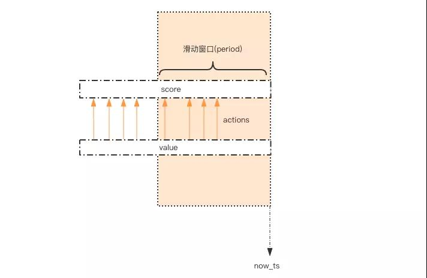

## 应用 6： 简单限流

限流算法在分布式领域是一个经常被提起的话题，当系统的处理能力有限时，如何阻止计划外的请求继续对系统施压，这是一个需要重视的问题。老钱在这里用 “断尾求生” 形容限流背后的思想，当然还有很多成语也表达了类似的意思，如弃卒保车、壮士断腕等等。

除了控制流量，限流还有一个应用目的是用于控制用户行为，避免垃圾请求。比如在 UGC 社区，用户的发帖、回复、点赞等行为都要严格受控，一般要严格限定某行为在规定时间内允许的次数，超过了次数那就是非法行为。对非法行为，业务必须规定适当的惩处策略。

## 如何使用 Redis 来实现简单限流策略？

首先我们来看一个常见 的简单的限流策略。系统要限定用户的某个行为在指定的时间里只能允许发生 N 次，如何使用 Redis 的数据结构来实现这个限流的功能？

我们先定义这个接口，理解了这个接口的定义，读者就应该能明白我们期望达到的功能。

~~~python
# 指定用户 user_id 的某个行为 action_key 在特定的时间内 period 只允许发生一定的次数 max_count
def is_action_allowed(user_id, action_key, period, max_count):
    return True
# 调用这个接口 , 一分钟内只允许最多回复 5 个帖子
can_reply = is_action_allowed("laoqian", "reply", 60, 5)
if can_reply:
    do_reply()
else:
    raise ActionThresholdOverflow()...

~~~

## 解决方案

这个限流需求中存在一个滑动时间窗口，想想 zset 数据结构的 score 值，是不是可以通过 score 来圈出这个时间窗口来。而且我们只需要保留这个时间窗口，窗口之外的数据都可以砍掉。那这个 zset 的 value 填什么比较合适呢？它只需要保证唯一性即可，用 uuid 会比较浪费空间，那就改用毫秒时间戳吧。

如图所示，用一个 zset 结构记录用户的行为历史，每一个行为都会作为 zset 中的一个 key 保存下来。同一个用户同一种行为用一个 zset 记录。

为节省内存，我们只需要保留时间窗口内的行为记录，同时如果用户是冷用户，滑动时间窗口内的行为是空记录，那么这个 zset 就可以从内存中移除，不再占用空间。

通过统计滑动窗口内的行为数量与阈值 max_count 进行比较就可以得出当前的行为是否允许。用代码表示如下：
~~~python

# coding: utf8

import time
import redis

client = redis.StrictRedis()

def is_action_allowed(user_id, action_key, period, max_count):
    key = 'hist:%s:%s' % (user_id, action_key)
    now_ts = int(time.time() * 1000)  # 毫秒时间戳
    with client.pipeline() as pipe:  # client 是 StrictRedis 实例
        # 记录行为
        pipe.zadd(key, now_ts, now_ts)  # value 和 score 都使用毫秒时间戳
        # 移除时间窗口之前的行为记录，剩下的都是时间窗口内的
        pipe.zremrangebyscore(key, 0, now_ts - period * 1000)
        # 获取窗口内的行为数量
        pipe.zcard(key)
        # 设置 zset 过期时间，避免冷用户持续占用内存
        # 过期时间应该等于时间窗口的长度，再多宽限 1s
        pipe.expire(key, period + 1)
        # 批量执行
        _, _, current_count, _ = pipe.execute()
    # 比较数量是否超标
    return current_count <= max_count

for i in range(20):
    print is_action_allowed("laoqian", "reply", 60, 5)...

~~~
Java 版：

~~~java
public class SimpleRateLimiter {

  private Jedis jedis;

  public SimpleRateLimiter(Jedis jedis) {
    this.jedis = jedis;
  }

  public boolean isActionAllowed(String userId, String actionKey, int period, int maxCount) {
    String key = String.format("hist:%s:%s", userId, actionKey);
    long nowTs = System.currentTimeMillis();
    Pipeline pipe = jedis.pipelined();
    pipe.multi();
    pipe.zadd(key, nowTs, "" + nowTs);
    pipe.zremrangeByScore(key, 0, nowTs - period * 1000);
    Response<Long> count = pipe.zcard(key);
    pipe.expire(key, period + 1);
    pipe.exec();
    pipe.close();
    return count.get() <= maxCount;
  }

  public static void main(String[] args) {
    Jedis jedis = new Jedis();
    SimpleRateLimiter limiter = new SimpleRateLimiter(jedis);
    for(int i=0;i<20;i++) {
      System.out.println(limiter.isActionAllowed("laoqian", "reply", 60, 5));
    }
  }

}...

~~~

这段代码还是略显复杂，需要读者花一定的时间好好啃。它的整体思路就是：每一个行为到来时，都维护一次时间窗口。将时间窗口外的记录全部清理掉，只保留窗口内的记录。zset 集合中只有 score 值非常重要，value 值没有特别的意义，只需要保证它是唯一的就可以了。

因为这几个连续的 Redis 操作都是针对同一个 key 的，使用 pipeline 可以显著提升 Redis 存取效率。但这种方案也有缺点，因为它要记录时间窗口内所有的行为记录，如果这个量很大，比如限定 60s 内操作不得超过 100w 次这样的参数，它是不适合做这样的限流的，因为会消耗大量的存储空间。

